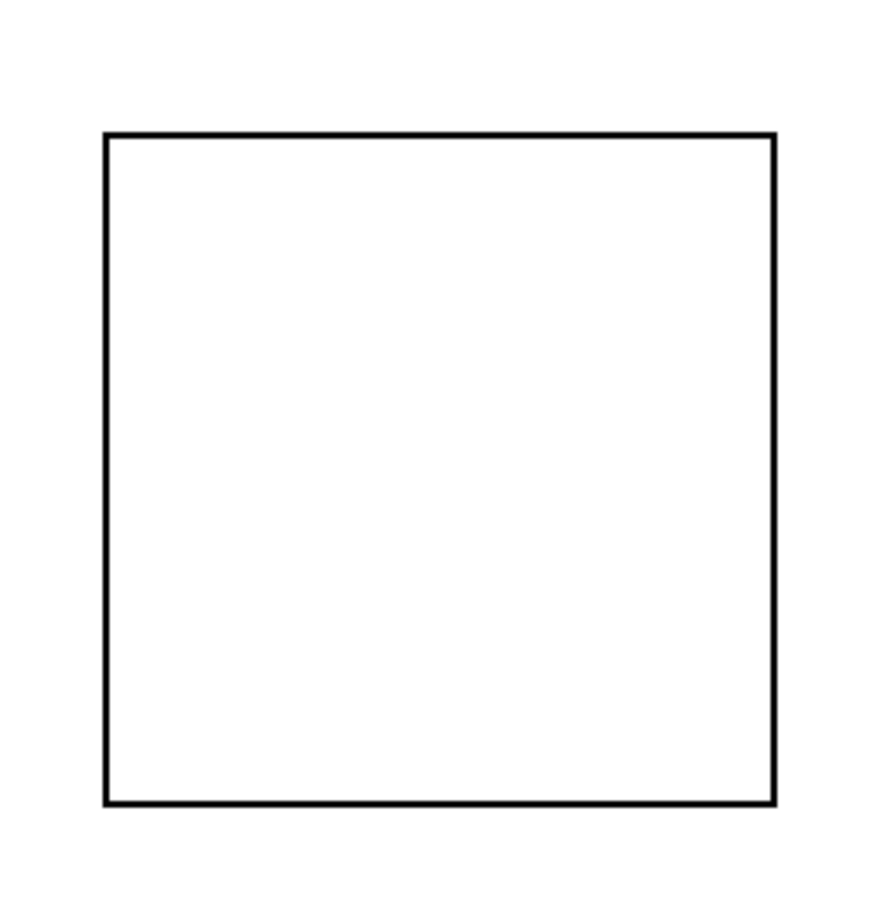
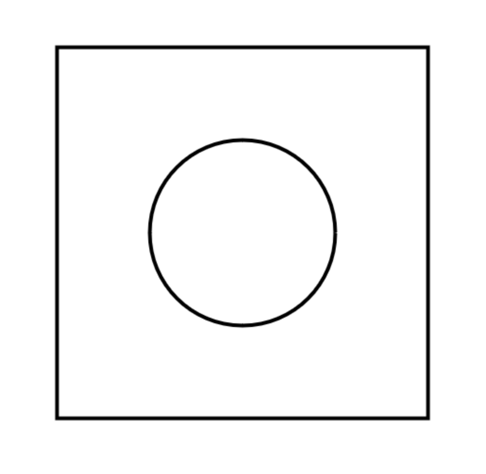

## Fundamentals - draw a square
First I will create a new html file with basic markup.
I added a `canvas` and a script tag where I will add my code.

```html
<!DOCTYPE html>
<html lang="en">
<head>
  <meta charset="UTF-8">
  <meta name="viewport" content="width=device-width, initial-scale=1.0">
  <title>Context Basics</title>
</head>
<body>
  <canvas id="canvas" width="600" height="600"></canvas>
  <script></script>
</body>
</html>
```

Let's start by creating a square in our script

```js
// Get a reference to the canvas element on the HTML page
let canvas = document.getElementById('canvas');

// Get a 2D rendering context from the canvas element
// This context will be used for all drawing operations on the canvas
let context = canvas.getContext('2d');

// Set the width of lines drawn on the canvas (in pixels)
context.lineWidth = 4;

// Begin a new path for drawing shapes.
// Subsequent drawing methods (like rect) will add to this path.
context.beginPath();

// Define a rectangle on the canvas with given dimensions
// (x-coordinate, y-coordinate, width, height)
context.rect(100, 100, 400, 400);

// Stroke the previously defined path (draw the outline of the rectangle)
context.stroke();
```

If everything went smoothly you should get a beautiful square on the screen  



## Fundamentals - draw a circle

Let's add a circle inside the square.  
The 2D Canvas API has a method ___CanvasRederingContext2D.arc()___ that allow us to draw arcs.  

### Parameters
- x
- y
- radius
- startAngle
- endAngle
- anticlockwise  

With a bit of code it looks like this

```js
// begin a new path to create shapes
context.beginPath();
// draw a circle in the middle of our canvas
// x: 300, y: 300, radius: 100, startAngle: 0, endAngle: PI*2
context.arc(300, 300, 100, 0, Math.PI * 2);
//draw the outline of previously defined path (draw the outline of the circle)
context.stroke();
```

And if everything went correctly you will have a circle inside the square



